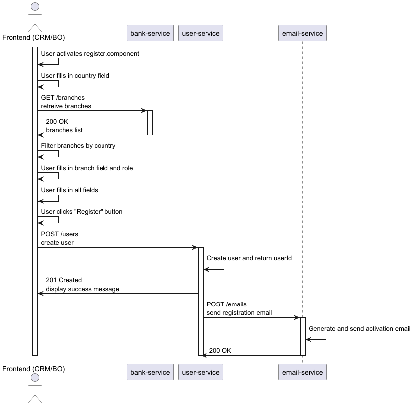

# Customer Registration Process (DRAFT)

## 1. Overview
This document describes the end-to-end customer registration process exactly as represented in the PlantUML sequence diagram located in: `docs/domain/assets/registration/customer-registration/customer-registration-process-diagram.md`.

[Open PNG in a new tab](../../../assets/registration/customer-registration/customer-registration-process-diagram.png)

The goal of the process is to allow a user (prospective customer or operator) to create an account and trigger an activation / notification email after successful persistence of the user record.

## 2. Actors and Systems
| Actor / System | Role in Flow |
| -------------- | ------------ |
| Frontend (FE) – Angular app (`register.component.ts`) | Collects input, orchestrates UI steps, invokes backend APIs |
| `bank-service` | Provides branch data |
| `user-service` | Persists the new user (POST /users) and returns `userId` |
| `email-service` | Sends registration / activation email after user creation |

## 3. Detailed Sequence (Step-by-Step)
Below is a textual transcription strictly mirroring the sequence diagram order.

1. User opens the registration page – FE activates `register.component`.
2. User fills the country field (value held locally in the component state / form model).
3. FE calls `bank-service` endpoint: `GET /branches` (intended to retrieve all branches; country filtering is performed client-side).
4. `bank-service` responds `200 OK` with a list of branches.
5. FE filters the received branch list by the previously selected country.
6. User selects (fills) the branch field and also chooses role (e.g. customer or operator).
7. User completes the remaining required fields (e.g. personal + credential fields).
8. User clicks the "Register" button (form submission event inside `register.component`).
9. FE sends `POST /users` to `user-service` with the assembled payload (username, email, role(s), company/branch identifiers as applicable).
10. `user-service` creates the user entity and generates a new `userId`.
11. `user-service` responds to FE with `201 Created` including newly created user data (at minimum the `userId`). FE displays a success confirmation to the user.
12. `user-service` invokes `email-service` via `POST /emails` to trigger a registration/activation email.
13. `email-service` composes and sends the activation email (e.g., containing activation link or next-step instructions).
14. `email-service` returns `200 OK` to `user-service` confirming the email send operation.

## 4. Backend API Contracts
| Service | Endpoint | Method | Purpose |
| ------- | -------- | ------ | ------- |
| bank-service | `/branches` | GET | Retrieve full branch list before client-side filtering |
| user-service | `/users` | POST | Create new user record |
| email-service | `/emails` | POST | Send registration / activation email |
